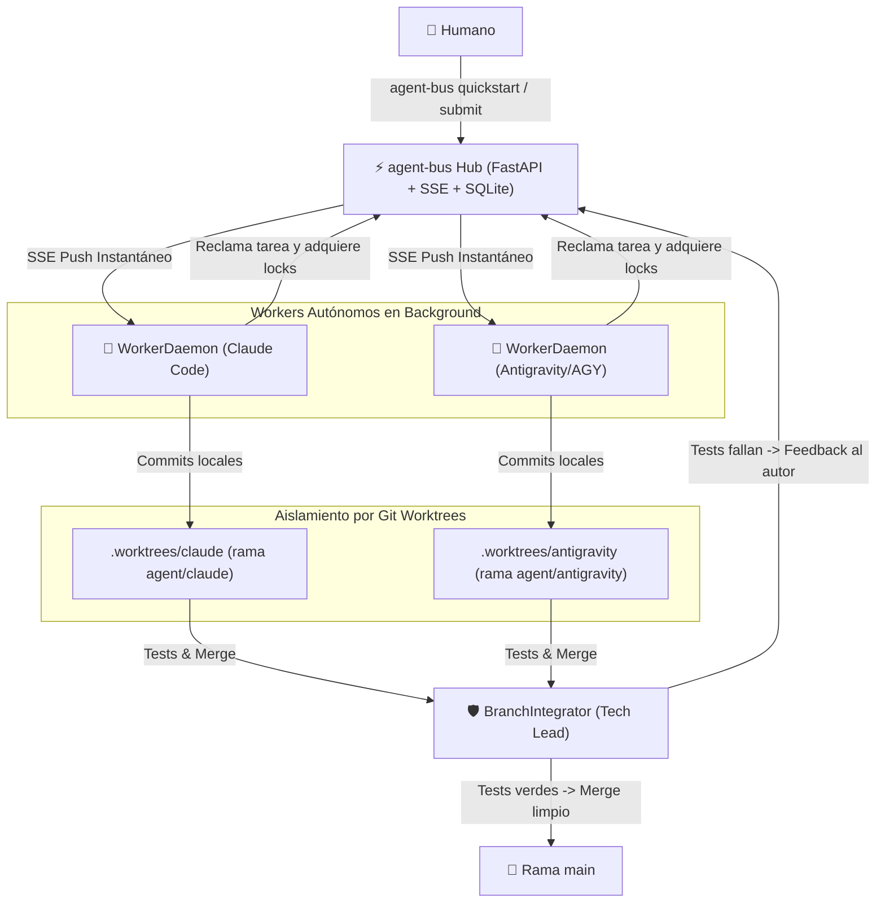

# agent-bus ⚡

[](https://github.com/yasmanycastillo/agent-bus)
[](https://python.org)
[](https://fastapi.tiangolo.com)
[](LICENSE)

**Protocolo y bus de eventos distribuido para la orquestación autónoma de equipos multi-agente de Inteligencia Artificial.**

`agent-bus` permite que múltiples agentes de IA (**Claude Code**, **Antigravity / AGY**, **OpenAI Codex**, **Grok**, **Aider**) colaboren en un mismo proyecto de código en tiempo real, de forma **completamente autónoma y sin requerir un humano como mensajero manual entre terminales**.

---

## 🌟 Características Principales



1. **Bucle Multi-Agente 100% Autónomo**:
   * Los agentes reciben asignaciones de tareas y consultas urgentes vía push por **Server-Sent Events (SSE)**.
   * Ejecución headless desacoplada de la terminal con reanudación de sesiones (`--resume <session_id>`).
2. **Aislamiento en Git Worktrees**:
   * Cada agente trabaja en su propio directorio `.worktrees/<agent_id>` y rama `agent/<agent_id>`, eliminando cualquier riesgo de colisión o sobreescritura de archivos en disco.
3. **Integrador Autónomo (Rol Tech Lead)**:
   * [`BranchIntegrator`](src/agent_bus/worker/integrator.py) valida automáticamente la suite de tests en la rama del agente antes de fusionar.
   * Si los tests pasan, ejecuta el merge a `main`. Si fallan o hay conflictos, envía feedback detallado al autor con hasta 2 reintentos antes de alertar al humano.
4. **Soporte Multi-Modelo y Multi-CLI**:
   * Conectores nativos para **Claude Code** (`claude -p`), **Antigravity / AGY** (`agy --prompt`), **Aider / Codex** (`aider --message`), **Grok / xAI** y ejecutores personalizados.
5. **Seguridad Criptográfica Ed25519**:
   * Claves asimétricas por agente (`~/.agent-bus/agents/<id>.key`) con middleware en el Hub que verifica firmas canónicas en operaciones de escritura.
6. **Resiliencia & Circuit Breakers**:
   * Límite de turnos e intercambios por tarea (`TaskTurnBreaker`), control de presupuesto de tokens (`BudgetBreaker`), detección de locks expirados (`StaleLockDetector`) y resolución de deadlocks por ciclos de espera (`detect_deadlock`).
7. **Notificaciones Externas**:
   * Alertas nativas de escritorio (`notify-send` en Linux / `osascript` en macOS) y Webhooks (Telegram, Slack, Discord) cuando un objetivo se completa o se bloquea.
8. **Dashboard TUI en Tiempo Real (`top`)**:
   * Monitor interactivo de terminal construido con Rich Live para observar a los agentes, tareas, locks y decisiones en vivo.

---

## 🚀 Inicio Rápido (1 solo comando)

Para inicializar el servidor, registrar agentes y poner a trabajar a tu equipo autónomo:

```bash
uv run agent-bus quickstart
```

Esto ejecuta automáticamente:
1. Inicialización del proyecto (`.agent-bus/`).
2. Arranque del servidor daemon en background (`http://localhost:8420`).
3. Registro de agentes (`claude`, `antigravity`).
4. Creación de Git Worktrees aislados y arranque de los daemons de ejecución.

---

## 🕹️ Flujo de Trabajo y Comandos

### 1. Monitoreo en Vivo (TUI Dashboard)
Abre un dashboard interactivo en tiempo real con refresco automático:

```bash
uv run agent-bus top
```

### 2. Enviar Objetivos al Equipo Autónomo
Envía un requerimiento para que el equipo lo descomponga, reclame tareas y lo implemente:

```bash
uv run agent-bus submit "Implementar autenticación JWT y tests de integración"
```

### 3. Gestión de Workers en Background
Controla los procesos daemon de cada agente:

```bash
uv run agent-bus worker status               # Ver estado de los daemons activos
uv run agent-bus worker start --agent claude # Iniciar daemon para un agente
uv run agent-bus worker stop --agent claude  # Detener daemon
```

### 4. Lanzar Equipo con Configuración Personalizada
```bash
# Lanzar equipo con agentes específicos y worktrees sobre la rama main
uv run agent-bus run-team --agents "claude,antigravity,codex" --base-ref main
```

---

## 🛠️ Operaciones Diarias y CLI

| Comando | Descripción |
| :--- | :--- |
| `agent-bus quickstart` | Onboarding en 1 paso (inicializa bus, agentes y workers) |
| `agent-bus top` | Dashboard TUI interactivo en tiempo real con Rich Live |
| `agent-bus run-team` | Inicializa worktrees y arranca daemons de fondo |
| `agent-bus submit "<meta>"` | Envía un objetivo global al equipo |
| `agent-bus serve --daemon` | Inicia el servidor FastAPI como servicio de fondo |
| `agent-bus serve --stop` | Detiene el servidor |
| `agent-bus show` | Visualiza el dashboard del estado actual |
| `agent-bus show tasks` | Lista las tareas y sus responsables |
| `agent-bus show locks` | Muestra los archivos actualmente bloqueados |
| `agent-bus show agents` | Muestra el estado y capacidades de los agentes |
| `agent-bus work claim <id>` | Reclama una tarea disponible |
| `agent-bus work done <id>` | Marca una tarea como completada |
| `agent-bus work reassign <id> <agente>` | Reasigna el responsable de una tarea |
| `agent-bus work lock <archivo>` | Bloquea un archivo para edición concurrente segura |
| `agent-bus work unlock <archivo>` | Libera el bloqueo de un archivo |
| `agent-bus work msg <agente> "<texto>"` | Envía un mensaje directo al inbox de otro agente |
| `agent-bus work decide "<titulo>" "<desc>"` | Registra un registro de decisión arquitectónica (ADR) |

---

## 💻 Desarrollo Multi-Terminal

Si tienes varias terminales abiertas (por ejemplo, una con **Claude Code** y otra con **Antigravity** o un humano), puedes aislar la identidad de cada terminal exportando la variable de entorno:

```bash
# Terminal 1 (Claude)
export AGENT_BUS_AGENT_ID=claude

# Terminal 2 (Antigravity)
export AGENT_BUS_AGENT_ID=antigravity
```

---

## 🧪 Suite de Pruebas

`agent-bus` cuenta con una suite completa de pruebas unitarias y de integración end-to-end:

```bash
uv run pytest
```

---

## 📖 Arquitectura Detallada

Para consultar el diseño técnico completo, flujo de diagramas de secuencia Mermaid, criptografía Ed25519 y modelo de consenso BFT, consulta:
👉 **[`docs/autonomous_multi_agent_architecture.md`](docs/autonomous_multi_agent_architecture.md)**
