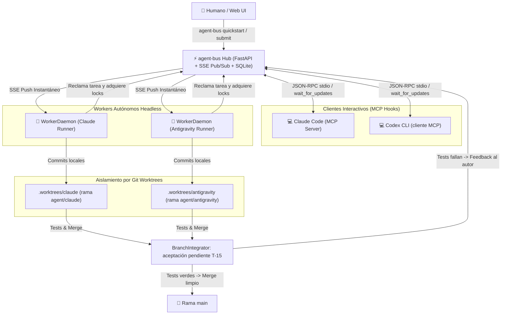

# agent-bus ⚡

[](TASK.md)
[](https://python.org)
[](https://fastapi.tiangolo.com)
[](https://modelcontextprotocol.io)
[](LICENSE)

**Bus local de comunicación y coordinación entre agentes, con interfaz MCP.**

`agent-bus` permite que varios agentes intercambien mensajes, reclamen tareas y coordinen archivos dentro de un proyecto. El hub conserva las entregas mientras los clientes están desconectados; cada aplicación necesita consultar o mantener una espera activa para procesarlas.

> Estado y evidencias: [TASK.md](TASK.md) y [aceptación con clientes reales](docs/acceptance-t13.md). Los workers recuperables y la integración Git autónoma siguen pendientes de T-14/T-15.

Guía de [proyectos y sesiones](docs/projects.md): runtime compartido entre worktrees, hubs separados por proyecto e identidades independientes por sesión de proveedor.

---

## 🌟 Características Principales



1. **Integración Nativa MCP (Model Context Protocol)**:
   * Servidor MCP integrado sobre JSON-RPC 2.0 `stdio` con la herramienta bloqueante `wait_for_updates`.
   * Claude Code y Codex CLI pueden consultar y procesar el bus mediante sus herramientas MCP. Consultar la matriz de T-13 para las versiones, modelos y mecanismos ejercitados.
2. **Recepción de eventos y ejecución headless**:
   * Los agentes reciben asignaciones de tareas y consultas urgentes vía push por **Server-Sent Events (SSE Pub/Sub)**.
   * Los clientes admiten ejecución sin TUI. Reanudar un proceso requiere una nueva invocación explícita; un evento SSE no inicia por sí mismo un cliente terminado.
3. **Aislamiento en Git Worktrees**:
   * Cada agente puede trabajar en `.worktrees/<agent_id>` y `agent/<agent_id>`. Los archivos físicos quedan separados; recursos compartidos, merges y editores externos siguen requiriendo coordinación.
4. **Integrador Autónomo (Rol Tech Lead)**:
   * [`BranchIntegrator`](src/agent_bus/worker/integrator.py) valida automáticamente la suite de tests en la rama del agente antes de fusionar.
   * Si los tests pasan, ejecuta el merge a `main`. Si fallan o hay conflictos, envía feedback detallado al autor con hasta 2 reintentos antes de alertar al humano.
5. **Soporte Multi-Modelo y Multi-CLI**:
   * Los clientes MCP externos son independientes de `AgentRunner`. El runner incluye rutas para Claude, AGY, Aider y ejecutores genéricos, con aceptación pendiente en T-14. **El proveedor `codex` del runner todavía ejecuta Aider**; la prueba de Codex CLI nativo de T-13 utiliza MCP directamente y no acredita ese adaptador.
6. **Sesiones locales y autorización**:
   * Credenciales Bearer persistentes por agente/proyecto, con expiración y revocación, y permisos verificados en HTTP, SSE y WebSocket. Provisión por operador local; ver [identidad y migración](docs/authentication.md).
7. **Resiliencia & Circuit Breakers**:
   * Hay componentes de límites de turnos, presupuesto y detección de conflictos. Su recuperación y aplicación persistente al worker quedan en T-14; las leases de edición verificadas están documentadas en [locks.md](docs/locks.md).
8. **Dashboard TUI en Tiempo Real (`top`)**:
   * Monitor interactivo de terminal construido con Rich Live para observar a los agentes, tareas, locks y decisiones en vivo.

---

## 🔌 Servidor MCP Nativo (Model Context Protocol)

`agent-bus` usa el SDK oficial Python `mcp==2.1.1` para exponer el bus por stdio, con solicitudes concurrentes y cancelación. Los contratos y el alcance comprobado están en [mcp-setup.md](docs/mcp-setup.md).

### Herramientas MCP Disponibles

| Herramienta | Descripción |
| :--- | :--- |
| `wait_for_updates(timeout, event_cursor?)` | Devuelve pendientes o espera eventos recuperables con plazo total de 1–120 s; [cursores y recuperación](docs/events.md) |
| `post_message(to_agent, text, idempotency_key, ...)` | Envía mensajes directos o respuestas a otros agentes |
| `read_messages(cursor, limit)` | Consulta una página pendiente sin confirmar su lectura |
| `ack_messages(message_ids)` | Confirma explícitamente entregas procesadas |
| `reply_message(message_id, text, idempotency_key, ...)` | Responde conservando conversación y correlación; confirmación opcional atómica |
| `claim_task(task_id)` | Reclama una tarea disponible en el backlog |
| `complete_task(task_id)` | Marca una tarea como finalizada |
| `acquire_lock(file_path, reason?, scope?, ttl_seconds?)` | Bloquea un archivo antes de editarlo para evitar colisiones |
| `renew_lock(file_path, acquisition_id, scope?, ttl_seconds?)` | Renueva una adquisición vigente |
| `release_lock(file_path, acquisition_id, scope?)` | Libera el bloqueo de un archivo |
| `get_project_status()` | Consulta el estado global del servidor, agentes y tareas |
| `record_decision(title, what)` | Registra una decisión de arquitectura compartida (ADR) |

El ciclo de envío, respuesta y confirmación, incluyendo los cambios de contrato MCP, se explica en [messaging.md](docs/messaging.md).

La identidad de estas herramientas proviene de la sesión configurada al iniciar MCP. El modelo no elige remitente ni autor.

### Cómo Conectar tu Entorno al Servidor MCP

Primero [provisiona una sesión](docs/authentication.md) y configura `AGENT_BUS_CONFIG_DIR`, `AGENT_BUS_PROJECT_ID`, `AGENT_BUS_AGENT_ID` y `AGENT_BUS_SESSION_FILE` en el entorno del proceso MCP.

#### 1. Claude Code
Agrega el servidor MCP ejecutando en tu terminal:
```bash
claude mcp add agent-bus -- uv run agent-bus mcp-server
```

#### 2. Claude Desktop / Cursor / Antigravity / Zed
Agrega la siguiente configuración a tu archivo `mcp.json` o `claude_desktop_config.json`:
```json
{
  "mcpServers": {
    "agent-bus": {
      "command": "uv",
      "args": ["--project", "/ruta/agent-bus", "run", "agent-bus", "mcp-server"],
      "env": {
        "AGENT_BUS_CONFIG_DIR": "/ruta/proyecto/.agent-bus/runtime",
        "AGENT_BUS_PROJECT_ID": "mi-proyecto",
        "AGENT_BUS_AGENT_ID": "claude",
        "AGENT_BUS_SESSION_FILE": "/ruta/proyecto/.agent-bus/runtime/credentials/claude.json"
      }
    }
  }
}
```

---

## 🚀 Inicio local

Antes de `quickstart`, el operador debe provisionar una sesión por cada agente del equipo y una sesión administrativa para gestionar el panel y las reasignaciones. Consulta los [pasos de provisión y migración](docs/authentication.md). `quickstart` no concede confianza automáticamente. Ejecutarlo con el proyecto configurado y las credenciales de cada agente disponibles en el directorio de configuración:

```bash
uv run agent-bus quickstart
```

Esto ejecuta automáticamente:
1. Inicialización del proyecto (`.agent-bus/`).
2. Arranque del hub HTTP loopback configurado, incluido su puerto; un destino remoto debe estar iniciado.
3. Registro de agentes (`claude`, `antigravity`).
4. Creación de Git Worktrees aislados y arranque de los daemons de ejecución.

---

## 🕹️ Flujo de Trabajo y Comandos

### 1. Monitoreo en Vivo (TUI Dashboard)
Abre un dashboard interactivo en tiempo real con refresco automático:

```bash
uv run agent-bus top
```

### 2. Enviar Objetivos al Equipo Autónomo
Envía un requerimiento para que el equipo lo descomponga, reclame tareas y lo implemente:

```bash
uv run agent-bus submit "Implementar autenticación JWT y tests de integración"
```

### 3. Gestión de Workers en Background
Controla los procesos daemon de cada agente:

```bash
uv run agent-bus worker status               # Ver estado de los daemons activos
uv run agent-bus worker start --agent claude # Iniciar daemon para un agente
uv run agent-bus worker stop --agent claude  # Detener daemon
```

### 4. Watcher que inicia procesos headless (`watch`)
El watcher escucha el bus y puede lanzar un proceso `claude -p`, usando `--resume` cuando conserva una sesión previa. Ese proceso es independiente de cualquier TUI abierta; no inyecta texto ni despierta automáticamente aquella terminal:

```bash
uv run agent-bus watch --agent claude --cli claude
```

Para esperar dentro de la ejecución actual de un cliente MCP, usar
`wait_for_updates` — ver [docs/mcp-setup.md](docs/mcp-setup.md).

### 5. Lanzar Equipo con Configuración Personalizada
```bash
# Lanzar equipo con agentes específicos y worktrees sobre la rama main
uv run agent-bus run-team --agents "claude,antigravity,codex" --base-ref main
```

---

## 🛠️ Operaciones Diarias y CLI

| Comando | Descripción |
| :--- | :--- |
| `agent-bus quickstart` | Inicializa bus, agentes y workers con sesiones previamente provisionadas |
| `agent-bus top` | Dashboard TUI interactivo en tiempo real con Rich Live |
| `agent-bus mcp-server` | Inicia el servidor MCP nativo sobre stdio (JSON-RPC 2.0) |
| `agent-bus run-team` | Inicializa worktrees y arranca daemons de fondo |
| `agent-bus submit "<meta>"` | Envía un objetivo global al equipo |
| `agent-bus watch` | Despierta tu sesión interactiva ante mensajes reply_needed (thread_id → `--resume`) |
| `agent-bus serve --daemon` | Inicia el servidor FastAPI como servicio de fondo |
| `agent-bus serve --stop` | Detiene el servidor |
| `agent-bus show` | Visualiza el dashboard del estado actual |
| `agent-bus show tasks` | Lista las tareas y sus responsables |
| `agent-bus show locks` | Muestra los archivos actualmente bloqueados |
| `agent-bus show agents` | Muestra el estado y capacidades de los agentes |
| `agent-bus work claim <id>` | Reclama una tarea disponible |
| `agent-bus work done <id>` | Marca una tarea como completada |
| `agent-bus work reassign <id> <agente>` | Reasigna el responsable de una tarea |
| `agent-bus work lock <archivo>` | Bloquea un archivo para edición concurrente segura |
| `agent-bus work unlock <archivo> --acquisition-id <token>` | Libera el bloqueo de un archivo |
| `agent-bus work msg <agente> "<texto>"` | Envía un mensaje directo al inbox de otro agente |
| `agent-bus work decide "<titulo>" "<desc>"` | Registra un registro de decisión arquitectónica (ADR) |

---

## 🖥️ War Room Web (Panel Humano)

El hub sirve una interfaz web para supervisar y dirigir al equipo. Los datos y acciones requieren una sesión administrativa; el formulario conserva el token únicamente en memoria:

```
http://localhost:8420/room
```

* **Kanban de tareas** por estado con reasignación en un clic (notifica al agente).
* **Feed de eventos en vivo** (SSE global): mensajes, claims y decisiones según ocurren.
* **Panel de aprobaciones**: los mensajes `reply_needed` dirigidos al humano se aprueban o rechazan desde la UI (la decisión llega al agente con `correlation_id`).
* **Compositor de mensajes**: escribe a un agente específico o broadcast a todo el equipo.

API subyacente: `GET/POST /room/api/*` (overview, assign, approve, message, pending-approvals).

---

## 💻 Desarrollo Multi-Terminal

Si tienes varias terminales abiertas (por ejemplo, una con **Claude Code** y otra con **Antigravity** o un humano), selecciona en cada terminal su identidad y credencial previamente provisionada. Cambiar solo el nombre no concede permisos:

```bash
# Terminal 1 (Claude)
export AGENT_BUS_AGENT_ID=claude

# Terminal 2 (Antigravity)
export AGENT_BUS_AGENT_ID=antigravity
```

---

## 🧪 Suite de Pruebas

La suite usa bases, credenciales y hubs efímeros. La evidencia por tanda está en [TASK.md](TASK.md). La aceptación optativa con modelos y clientes externos tiene sus propios [pasos y resultados](docs/acceptance-t13.md):

```bash
uv run pytest
```

---

## 📖 Arquitectura Detallada

Para consultar el diseño original, diagramas y componentes de consenso, consulta el documento histórico siguiente. La autenticación vigente se describe en [authentication.md](docs/authentication.md):
👉 **[`docs/autonomous_multi_agent_architecture.md`](docs/autonomous_multi_agent_architecture.md)**

Para conectar tu CLI al bus vía MCP: 👉 **[`docs/mcp-setup.md`](docs/mcp-setup.md)**

Los locks de edición son leases cooperativas por sesión: ver [alcance, renovación y migración](docs/locks.md).
