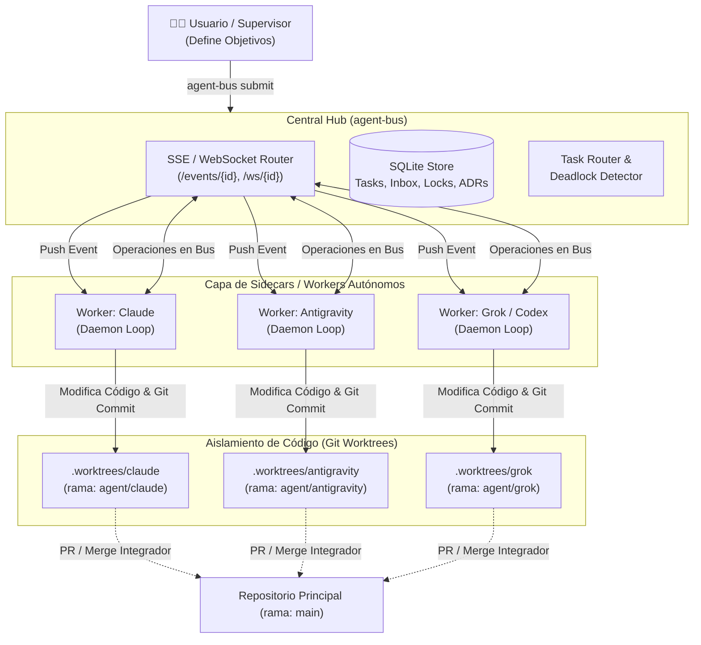

# Arquitectura de Ejecución Multi-Agente Autónoma Desatendida

## 1. Resumen Ejecutivo y Problemática

### El Problema de las CLIs Interactivas Tradicionales
En las herramientas de desarrollo basadas en agentes IA (como Claude Code, Antigravity CLI / AGY, Aider, Codex CLI), el modelo de interacción estándar es **interactivo y pasivo**:
1. El agente procesa una solicitud del usuario.
2. Realiza cambios o responde en la consola.
3. Cede el control al prompt de la terminal y entra en estado de espera (*idle*), aguardando que un humano ingrese un nuevo comando o presione Enter.

Cuando se intenta coordinar un equipo de múltiples agentes heterogéneos (por ejemplo, **Claude**, **Antigravity**, **Grok** y **Codex**) trabajando en un mismo proyecto, el humano se convierte en un cuello de botella ineficiente: debe ir terminal por terminal avisando a cada agente que otro ya terminó, que hay mensajes nuevos en el buzón o que una tarea fue desbloqueada.

### Objetivo
Diseñar e implementar una arquitectura **reactiva a eventos y 100% desatendida (*Event-Driven Autonomous Multi-Agent Loop*)**, donde un equipo de agentes IA opere en paralelo sobre el mismo repositorio, se comuniquen, bloqueen archivos, ejecuten código y transfieran tareas de forma continua y autónoma, notificando al usuario solo cuando se complete la meta global o se requiera una decisión estratégica.

---

## 2. Diagnóstico del Estado Actual de `agent-bus`

`agent-bus` provee la infraestructura base de transporte y gobernanza, pero requiere una capa de ejecución para lograr la autonomía total:

| Capa / Módulo | Estado en `agent-bus` | Descripción |
|---|---|---|
| **Almacenamiento de Estado y Persistencia** | ✅ Implementado | SQLite asíncrono (`aiosqlite`): Tareas, Locks, Inbox, Decisiones, Reputación. |
| **API Central y Canales Push** | ✅ Implementado | Servidor FastAPI con REST, WebSockets (`/ws/{agent_id}`) y SSE (`/events/{agent_id}`). |
| **Gobernanza y Consenso** | ✅ Implementado | Firmas Ed25519 con PyNaCl, Consenso BFT adaptativo y Reputación ponderada. |
| **Exclusión Mutua de Archivos (Locks)** | ✅ Implementado | `LockManager` para evitar ediciones simultáneas. |
| **Aislamiento de Espacio de Trabajo** | ⚠️ Pendiente | Automatización de `git worktree` por agente. |
| **Worker / Sidecar Autónomo** | ⚠️ Pendiente | Proceso en background que escucha el socket e invoca al LLM automáticamente. |
| **Ejecución Headless del LLM** | ⚠️ Pendiente | Conectores para invocar CLIs (`claude -p`, `agy`, `aider`) o APIs directas con Function Calling. |

---

## 3. Arquitectura del Sistema Autónomo

La arquitectura se compone de 4 capas desacopladas:



---

## 4. Los 4 Pilares Técnicos

### 1. Aislamiento por Git Worktrees
Para evitar colisiones de archivos y estados inconsistentes en disco:
* Cada agente opera en su propia carpeta enlazada como `git worktree`:
  * `.worktrees/claude` vinculado a la rama `agent/claude`
  * `.worktrees/antigravity` vinculado a la rama `agent/antigravity`
  * `.worktrees/codex` vinculado a la rama `agent/codex`
* Los agentes hacen `commit` y `push` dentro de su rama de trabajo.
* Un agente con rol de **Tech Lead / Integrador** (o un pipeline local) verifica los tests y fusiona los cambios a `main`.

**Flujo de integración ante fallos** (merge semantics):
1. El worker hace commit en su rama `agent/<id>` y marca la tarea `in_review`.
2. El integrador ejecuta los tests **en el worktree de la rama candidata** antes de fusionar.
3. Si los tests fallan o hay conflicto de merge: el integrador NO fusiona; envía `msg` al agente autor con `reply_needed=true` adjuntando el output de tests/conflicto, y la tarea vuelve a `in_progress` con el agente original como owner (no re-asignación: el autor conoce su código).
4. Máximo 2 ciclos de integración fallida por tarea; al tercero, la tarea pasa a `blocked` y se emite alerta al canal de notificación externa (human-in-the-loop).
5. Conflictos que el autor no resuelva en su rama (rebase contra `main`) los resuelve el integrador solo si son triviales (< 20 líneas); si no, `blocked`.

### 2. El Daemon Worker / Sidecar Runner
Cada agente tiene un proceso en segundo plano escuchando eventos del bus.

**Autenticación del worker**: el daemon reutiliza la infraestructura de firmas Ed25519 ya existente en el bus (no la bypassa). Cada worker carga la clave privada de su agente y firma sus operaciones de escritura (claim, done, msg, decide, lock); el hub valida la firma en los endpoints de escritura. El registro de agentes (`/agents`) es la raíz de confianza: un worker solo puede operar como un agente registrado con clave válida. Beneficio adicional: trazabilidad de auditoría — toda acción desatendida queda firmada por quien la ejecutó.

**Despertar selectivo por prioridad de eventos**:
* Los mensajes con `reply_needed=true` generan un evento `message_received` de prioridad **alta** → despiertan al worker destino inmediatamente (si está busy, se encola al final del turno en curso).
* Los broadcasts (`agent_card`, `ready`, decisions) NO despiertan; se acumulan en inbox y se consumen al iniciar un turno.

```python
# Flujo lógico del Daemon Worker
async def run_agent_daemon(agent_id: str, worktree_path: Path):
    async with connect_bus_events(agent_id) as event_stream:
        async for event in event_stream:
            # Tipos de eventos: task_assigned, message_received, lock_released, review_requested
            if is_actionable_event(event):
                # 1. Marcar estado a BUSY en el bus
                await set_agent_status(agent_id, "busy")
                
                # 2. Cargar contexto del repositorio, tareas e inbox
                prompt = assemble_context_prompt(agent_id, event, worktree_path)
                
                # 3. Ejecutar ciclo del agente (Headless CLI o API)
                result = await execute_agent_turn(agent_id, prompt, worktree_path)
                
                # 4. Procesar acciones (enviar mensajes, transferir tareas, liberar locks)
                await process_agent_actions(agent_id, result)
                
                # 5. Volver a estado ONLINE / LISTENING
                await set_agent_status(agent_id, "online")
```

### 3. Métodos de Invocación del Agente (Headless Execution)
El Worker ejecuta al agente sin requerir una interfaz interactiva de usuario a través de dos modalidades:

* **Estado de sesión**: cada turno del worker es **stateless**. El contexto se reconstruye desde el bus (inbox, tarea actual, última decisión) y el repo (git log del worktree), sin asumir memoria de sesión entre invocaciones.
* **Excepción — hilos de consulta entre agentes**: para conversaciones de revisión/consulta ("me consultan algo, respondo"), el mensaje de inbox lleva un `thread_id` y el worker usa `claude --resume <session_id> -p` para continuidad conversacional, manteniendo un mapping `thread_id → session_id`. Esto evita re-explicar contexto en cada respuesta de un hilo de discusión, que es distinto del caso de uso de ejecución de tareas.
* **Modalidad A: CLI Headless / Non-interactive (Herramientas existentes — MVP)**
  * **Claude Code**: `claude -p "<prompt_con_contexto>" --output-format json`
  * **Antigravity CLI**: Invocación en subagente aislado / headless runner
  * **Aider / Codex**: `aider --message "<prompt>" --yes` (sin `--no-git`: los agentes deben commitear en su rama, ver Pilar 1)
* **Modalidad B: Direct API con Function Calling (Recomendada para rendimiento)**
  * El worker utiliza directamente el SDK del proveedor (Anthropic, Google DeepMind, OpenAI, xAI) con *tools* expuestas:
    * `bus_send_message(to, text, reply_needed)`
    * `bus_claim_task(task_id)`
    * `bus_lock_file(path, reason)`
    * `bus_release_lock(path)`
    * `bus_record_decision(title, decision)`
    * `bus_handoff(task_id, to_agent, summary)`
    * `fs_read_file`, `fs_write_file`, `bash_run_test`

---

## 5. Ciclo de Vida y Diagrama de Secuencia de una Tarea

```mermaid
sequenceDiagram
    autonumber
    participant User as Humano / Goal
    participant Bus as agent-bus Hub
    participant AGY as Worker Antigravity (Arch)
    participant Claude as Worker Claude (Dev)
    participant WT_Claude as Worktree Claude

    User->>Bus: submit "Crear módulo de autenticación"
    Bus->>Bus: Crea tareas T1 (Diseño), T2 (Implementación), T3 (Tests)
    
    Bus->>AGY: Event: Task T1 disponible
    AGY->>Bus: claim T1 & lock src/auth/schema.py
    AGY->>AGY: Genera arquitectura y esquemas
    AGY->>Bus: decide "Usar JWT con rotación"
    AGY->>Bus: unlock src/auth/schema.py & complete T1
    AGY->>Bus: handoff T2 a Claude (summary + schema.py)
    
    Bus->>Claude: Event: Handoff T2 & Msg de Antigravity
    Note over Claude: Claude se activa automáticamente (sin humano)
    Claude->>Bus: claim T2 & lock src/auth/service.py
    Claude->>WT_Claude: Escribe código en su worktree
    Claude->>WT_Claude: Ejecuta pytest local en su worktree
    Claude->>WT_Claude: git commit -m "feat: auth service"
    Claude->>Bus: unlock src/auth/service.py & complete T2
    Claude->>Bus: msg Antigravity "T2 lista, procede con T3"
    Claude->>Bus: msg Antigravity "¿JWT o session cookie?" (reply_needed=true, thread_id)

    Bus->>AGY: Event: message_received (prioridad alta)
    Note over AGY: AGY se despierta solo (sin humano); --resume continúa el hilo
    AGY->>Bus: msg Claude "JWT con rotación (decisión D1)"

    Bus->>User: Notificación: Objetivo completado con éxito
```

---

## 6. Mecanismos de Seguridad, Resiliencia y Mitigación de Riesgos

Para garantizar que el sistema pueda operar de forma desatendida sin riesgo de bucles infinitos, saturación de hardware o consumo desmedido de recursos:

1. **Límite de Turnos por Tarea (*Max Turn Cap*)**:
   * Si dos agentes intercambian más de $N$ mensajes (por ejemplo, 10) sobre la misma tarea sin cambiar el estado a `done` o `in_progress`, el bus detiene la tarea y emite una alerta.
2. **Expiración de Locks y Detección de Deadlocks**:
   * Si un lock permanece activo sin actividad de heartbeat por más de 10 minutos, se marca como estancado (*stale*) y se revoca automáticamente.
   * Detección de ciclos de dependencia (Agente A espera archivo de B, mientras B espera archivo de A).
3. **Control de Concurrencia Local y Rate Limits de APIs**:
   * **Límite de Workers Concurrentes**: Para evitar saturar CPU/RAM local y agotar límites de peticiones por minuto (RPM/TPM) de los proveedores LLM, se define un umbral máximo (`max_active_workers: 2` por defecto).
   * **Backoff Adaptativo**: Si un worker recibe un error HTTP 429 (Rate Limit), se aplica retroceso exponencial y se pausa la ejecución de nuevas tareas en ese proveedor.
4. **Política de Compactación de Contexto (*Prompt Compaction*)**:
   * Al re-ensamblar el contexto (`assemble_context_prompt`), el worker **no** inyecta historiales ciegos ni diffs gigantescos.
   * Se incluye únicamente: la tarea actual con sus criterios de aceptación, el `git diff` de la rama de trabajo local, el último mensaje relevante del inbox y las decisiones arquitectónicas vigentes (ADRs).
5. **Recuperación ante Caídas de Worker (*Crash Recovery & Orphan Tasks*)**:
   * Si el proceso daemon de un worker muere o pierde conexión:
     * El bus detecta la ausencia de latido (`heartbeat_miss_threshold`).
     * Libera automáticamente los locks huérfanos asociados a ese agente.
     * Re-encola la tarea activa de `in_progress` a `pending` (o a `blocked` si falló repetidamente) para que otro agente pueda retomarla o se alerte al usuario.
6. **Límite de Presupuesto / Tokens**:
   * Control de costo máximo por objetivo o tarea.
7. **Canal de Notificación Externa**:
   * Notificación al usuario vía Webhook (Telegram, Slack, Discord) o notificación de escritorio de Linux (`notify-send`) únicamente ante:
     * Objetivo completado.
     * Error no recuperable o Deadlock detectado.
     * Solicitud de aprobación humana explícita (*Human-in-the-loop*).


---

## 7. Plan de Implementación (Roadmap de Módulos)

Para incorporar esta capacidad directamente en `agent-bus`, se estructura el nuevo paquete `agent_bus.worker`:

```
src/agent_bus/
├── worker/
│   ├── __init__.py
│   ├── client.py         # Cliente WebSocket / SSE con reconexión automática
│   ├── worktrees.py      # Creación y sincronización de Git Worktrees
│   ├── runner.py         # Controladores de ejecución (Claude, AGY, Codex, Grok)
│   ├── tools.py          # Definición de herramientas Function Calling para los LLMs
│   ├── circuit_breaker.py# Control de límites de turnos, costos y deadlocks
│   └── daemon.py         # Proceso principal de ejecución en background
└── cli/
    └── worker_cmds.py    # Comandos: `agent-bus worker start`, `agent-bus run-team`
```

### Nuevos Comandos CLI Propuestos:
* `agent-bus run-team --agents claude,antigravity,grok`: Inicializa el bus, crea los worktrees aislados y lanza los workers en background.
* `agent-bus submit "Objetivo del proyecto"`: Publica una meta para que el equipo la descomponga en tareas y comience la ejecución autónoma.
* `agent-bus team status`: Muestra el estado en tiempo real de cada worker y worktree.

### Plan de Fases

El MVP es **Pilar 2 + Modalidad A** (daemon + CLI headless + acciones vía CLI `agent-bus work`): permite validar el loop autónomo temprano sin construir el tool-schema de 4 proveedores. Modalidad B (Function Calling) y los circuit breakers completos son fase posterior.

| Fase | Alcance | Validación |
|---|---|---|
| **F1 — MVP del loop** | `worker/daemon.py` + `client.py` (SSE con reconexión) + runner Modalidad A solo Claude; eventos actionables: `task_assigned`, `message_received(reply_needed)` | Dos terminales: submit tarea → worker Claude la ejecuta y marca done, sin humano |
| **F2 — Equipo** | Runners AGY/Codex/Grok + worktrees automatizados + rol integrador con flujo de integración del Pilar 1 | submit objetivo multi-tarea → handoffs entre 2+ agentes |
| **F3 — Robustez** | Circuit breakers completos (turn cap, locks con heartbeat, presupuesto) + notificaciones externas + firmas Ed25519 del worker + mecanismos de la sección 6 | Pruebas de caos: agente caído, deadlock, bucle de mensajes |
