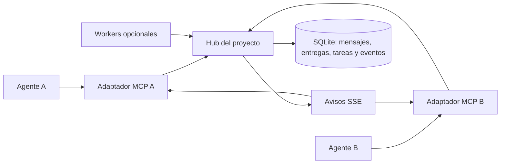

# Evaluación de agent-bus como MCP de comunicación entre agentes

Fecha de referencia: 2026-09-05, America/Santo_Domingo. Las reproducciones terminaron el 2026-09-06 UTC.

Estado al momento del diagnóstico: análisis inicial aceptado por el usuario, sin correcciones implementadas todavía. Este documento conserva esa fotografía histórica. Consultar [TASK.md](../TASK.md) para conocer la evolución de las correcciones y [context.md](../context.md) para retomar el proyecto.

## Valoración

El proyecto tiene una base útil, pero todavía es un prototipo de coordinación. Ya incluye un servidor MCP; el trabajo pendiente consiste en hacer confiables la entrega de mensajes, la identidad de los agentes y la exclusividad de las tareas.

Valoración cualitativa, no una métrica de cobertura: **7/10 como planteamiento y 4/10 como sistema listo para coordinar agentes autónomamente**. Conviene continuar desarrollándolo y concentrar primero el alcance en comunicación local mediante MCP.

La separación del hub y los clientes, la persistencia con SQLite, los conceptos de mensajes/tareas/locks/decisiones y los worktrees son bases adecuadas. SSE puede avisar de novedades. Hay una estructura modular y una suite considerable de pruebas. Sin embargo, algunas garantías del README todavía no se cumplen en la ejecución.

## Alcance y evidencia

Se revisaron código, documentación, pruebas y rutas de ejecución. Se ejecutó `uv run pytest -q`: **189 aprobadas y 1 fallida**, en 15,90 segundos. La prueba fallida fue `tests/test_mcp_server.py::test_mcp_wait_for_updates_timeout`: depende de un hub externo en `localhost:8420`; con el hub apagado obtuvo `status=error`, valor que la aserción no acepta.

Se hicieron reproducciones aisladas con SQLite temporal y HTTPX ASGITransport contra MessageBus, sin modificar el código de producción. La evidencia de payloads HTTP no equivale a una prueba completa mediante un cliente MCP real. No se verificó interoperabilidad extremo a extremo con los clientes anunciados. No había un grafo Graphify disponible; el diagnóstico procede de inspección directa y reproducciones.

El hub local estaba inaccesible durante el diagnóstico. Se dejó un watcher en modo observación intentando reconectar. Posteriormente se inició el hub en localhost para adquirir los locks de esta documentación; eso no cambia el resultado histórico de la suite.

## Hallazgos reproducidos

| ID | Prioridad | Resultado observado | Causa y corrección recomendada |
| --- | --- | --- | --- |
| H-01 | Crítica | Un broadcast para dos destinatarios dejó inboxes con 1 y 0 mensajes. | Se reutiliza `message_id`, clave primaria única del inbox. `INSERT OR IGNORE` descarta entregas posteriores. Separar mensaje y entrega por destinatario. |
| H-02 | Crítica | Dos agentes recibieron HTTP 200 al reclamar la misma tarea. | `claim` devuelve la tarea aunque su UPDATE no cambie ninguna fila. Verificar adquisición y devolver conflicto al perdedor. |
| H-03 | Crítica | Dos adquisiciones concurrentes de un lock terminaron sin error; ambas devolvieron al ganador como propietario. | Consultar antes de insertar no garantiza exclusividad; la inserción ignora conflictos. Hacer la adquisición atómica y el resultado inequívoco. |
| H-04 | Crítica | Una clave creada por el cliente permitió suplantar una identidad con `AGENT_BUS_ALLOW_UNSIGNED=0`. | Se acepta la clave pública del propio request. Verificar contra una identidad y credencial previamente vinculadas. |
| H-05 | Alta | Un agente pudo completar una tarea de otro: HTTP 200 y estado done. | El endpoint de finalización no valida al propietario. Autorizar las transiciones. |
| H-06 | Alta | El payload construido por `record_decision` produjo HTTP 422. | MCP envía `what` y omite campos requeridos como `decision_id` y `decision`. Unificar los contratos. |

Referencias de código:

- H-01: [bus.py](../src/agent_bus/core/bus.py), `post_message`; [inbox.py](../src/agent_bus/core/inbox.py), `deliver`; [database.py](../src/agent_bus/reputation/database.py), esquema `inbox`.
- H-02 y H-05: [tasks.py](../src/agent_bus/core/tasks.py), `claim` y `complete`; [bus.py](../src/agent_bus/core/bus.py), endpoints de tareas. El worker comienza trabajo al recibir HTTP 200, por lo que el falso éxito tiene efecto operativo.
- H-03: [locks.py](../src/agent_bus/core/locks.py), `acquire`.
- H-04: [auth.py](../src/agent_bus/worker/auth.py), `verify_operation`; [bus.py](../src/agent_bus/core/bus.py), middleware. Las escrituras sin firma están permitidas por defecto.
- H-06: [server.py](../src/agent_bus/mcp/server.py), `record_decision`; [bus.py](../src/agent_bus/core/bus.py), `DecisionRequest`.

## Mensajería: cerrar el ciclo de procesamiento

Las herramientas MCP permiten leer mensajes y esperar pendientes, pero no confirmarlos ni archivarlos. `post_message` tampoco expone correlación para responder explícitamente a un mensaje anterior. Por inspección, esto permite repetir el ciclo recibir → responder → esperar → recibir el mismo mensaje.

Agregar lectura paginada, confirmaciones explícitas, respuestas correlacionadas, conversación estable e idempotencia. La confirmación debe ocurrir después del procesamiento satisfactorio. El worker actual archiva después de ejecutar el runner incluso cuando este devuelve un resultado fallido: [daemon.py](../src/agent_bus/worker/daemon.py), `_handle_urgent_message`.

Hay una ventana entre consultar pendientes y suscribirse a SSE. Un mensaje puede llegar en ese intervalo sin despertar esa espera. Persistir eventos con secuencia y recuperar desde cursor permite cerrar esa ventana y reanudar tras desconexión. SSE debe ser un aviso; la base debe permitir recuperar los datos.

La garantía objetivo debe expresarse como entrega al menos una vez con procesamiento idempotente. No prometer ejecución exactamente una vez de efectos externos que el hub no controla.

## Robustez MCP

El servidor procesa una petición completa antes de leer la siguiente. Durante `wait_for_updates` no atiende otras solicitudes ni procesa cancelaciones por esa conexión. El timeout de HTTPX no establece por sí solo un límite total de duración del stream.

Adoptar un SDK MCP mantenido y probar inicialización, compatibilidad de versiones, validación de argumentos, solicitudes concurrentes, cancelación, errores y cierre durante una espera. No actualizar únicamente la constante de versión.

Referencias oficiales consultadas para estas recomendaciones:

- [Ciclo de vida MCP](https://modelcontextprotocol.io/specification/2025-06-18/basic/lifecycle): negociación, tiempos máximos y cierre.
- [Cancelación MCP](https://modelcontextprotocol.io/specification/2024-11-05/basic/utilities/cancellation): notificaciones de cancelación de solicitudes.
- [Esquema MCP](https://github.com/modelcontextprotocol/modelcontextprotocol/blob/main/docs/specification/2025-06-18/schema.mdx): errores de herramienta mediante `isError`.

Estas son referencias versionadas; al implementar se debe verificar la versión soportada por el SDK y los clientes objetivo.

## Eventos y activación de sesiones

Recibir un evento y despertar una sesión interactiva son capacidades diferentes:

- `wait_for_updates` funciona mientras el cliente la ejecuta.
- `watch` lanza un subproceso del CLI; eso no demuestra reactivación de la consola original.
- El hook de final de turno consulta en ese momento y no escucha mensajes posteriores permanentemente.
- El runner dispone de un adaptador Codex nativo (`codex exec` y `codex exec resume`); Aider conserva su propio adaptador.

Documentar una matriz por cliente con conexión, lectura, envío, espera, continuación de sesión y ejecución headless. Solo declarar probado lo demostrado con una versión concreta del cliente. La autonomía depende de un adaptador verificado para cada entorno.

## Arquitectura propuesta

Mantener SQLite inicialmente. Priorizar transacciones, recuperación y pruebas de concurrencia antes de introducir otra infraestructura.

Cada conexión debe estar asociada a proyecto, agente y sesión. El modelo no debería elegir libremente el remitente o autor de una decisión. Dos sesiones del mismo proveedor necesitan identidades operativas distintas. La configuración y los datos del proyecto deben resolverse de forma explícita, incluidos los worktrees.

Los locks necesitan rutas normalizadas, propietario por sesión, vencimiento y renovación. Son cooperativos: su efectividad depende de los ejecutores que los respeten. Definir si protegen recursos compartidos o archivos de un worktree; no bloquear innecesariamente cambios aislados en dos worktrees distintos.

## Integración Git y alcance

No se encontró invocación de `BranchIntegrator` desde el flujo del worker. Su implementación no cambia ni verifica la rama objetivo antes del merge, prueba la rama candidata pero no el resultado combinado y no verifica el código de salida del commit antes de declarar éxito. Referencia: [integrator.py](../src/agent_bus/worker/integrator.py).

Corregir esas garantías antes de activar merges autónomos. El primer MVP debe concentrarse en comunicación, entrega y coordinación; consenso BFT, reputación y merges automáticos quedan para después.

## Secuencia y criterio de salida

1. Corregir broadcasts, claims, locks, autorización y contratos MCP/HTTP.
2. Completar confirmaciones, correlación, idempotencia y recuperación de mensajes.
3. Consolidar MCP con identidad por conexión y pruebas stdio.
4. Validar dos agentes reales con los mecanismos soportados por sus clientes.
5. Incorporar autonomía y Git con recuperación y controles verificables.

El MVP será funcional cuando dos agentes puedan conversar, desconectarse, reconectarse y competir por trabajo sin perder entregas, duplicar efectos bajo reintentos controlados ni asumir ambos que poseen una tarea. Las pruebas deben levantar sus propios servicios y no depender del bus personal del desarrollador.
